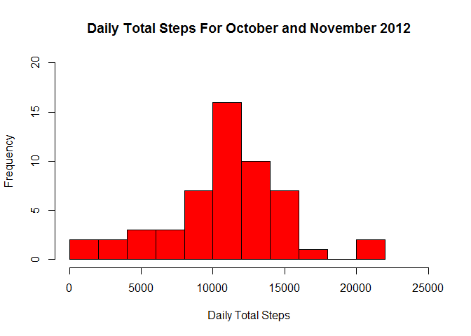
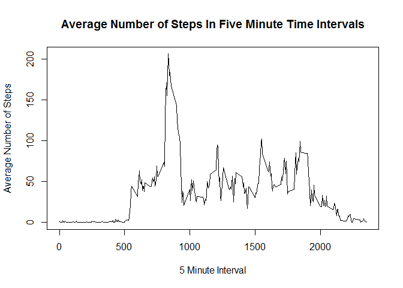
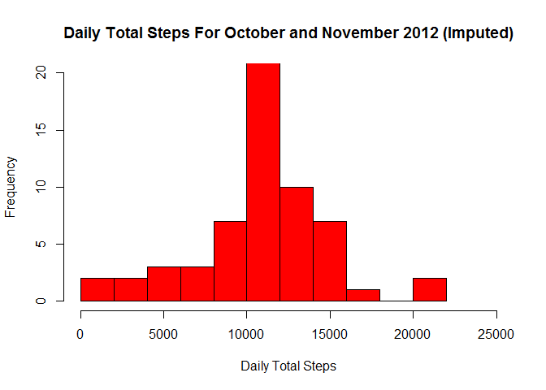
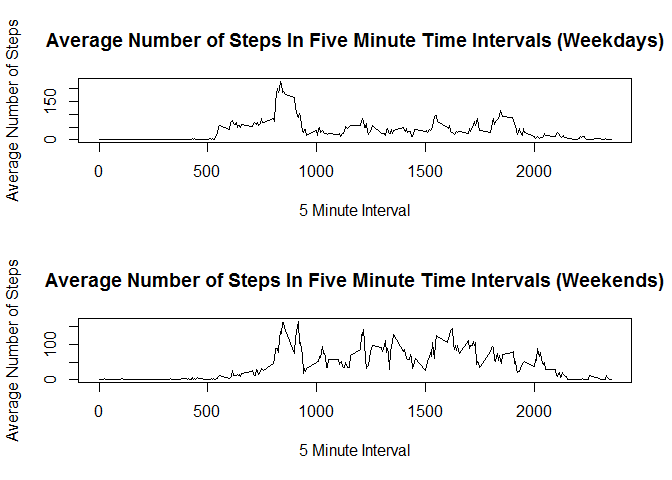

## Project Description
This project uses data collected using a personal activity monitoring device. The device collected data at 5 minute intervals throughout the day. The data contains observations of the number of steps taken in 5 minute intervals each day by an anonymous individual during the months of October and November of 2012. The data for this project are included in the [github repository](https://github.com/eickemea/RepData_PeerAssessment1) which contains the scripts for our analysis. The original data can also be found [here](https://d396qusza40orc.cloudfront.net/repdata%2Fdata%2Factivity.zip). For our analysis in this project, we used the data contained in the github repository. The data from the original source can also be used. However, if any changes are made to the original data that causes a divergence from the data in the github repository, it is possible that a reproduction of our analysis using the original data may yield different results.

The goal of this project is to load and preprocess the data and then answer the following questions: 

- What is the mean total number of steps taken per day?
- What is the average daily activity pattern? 
- What is the impact of imputing missing values? 
- Are there differences in activity patterns between weekdays and weekends?

## Loading and preprocessing the data
The read_data.R script reads in the activity monitoring data as a data table and adds a column that converts the *date* variable to the Date class. The script first checks to see if the csv file containing the data is in the working directory. If it is not, the data checks to see if the zip file containing the data is present. If it is, the script extracts the csv file from the zip file. Otherwise, the script downloads and unzips the data:


```r
#Download and/or Unzip data if necessary
if(!file.exists("activity.csv")){
      if(file.exists("activity.zip")){
            unzip("activity.zip")
      }else{
            temp <- tempfile()
            download.file("https://d396qusza40orc.cloudfront.net/
                        repdata%2Fdata%2Factivity.zip", destfile = temp)
            unzip(temp)
            unlink(temp)
      }
}
```

Next, the script reads in the data:


```r
# Read in the Data
data <- read.csv("activity.csv")
```

Finally, the script adds a new variable to the data frame, *asDate*, which is the *date* variable converted to the Date class. Then, the data frame is returned:


```r
# Add a new variable by converting the date variable to Date class
data$asDate <- as.Date(data$date, format = "%Y-%m-%d")

# Return the data
data
```

## What is mean total number of steps taken per day?
The mean_per_day.R script utilizes the data frame produced by the read_data.R script. The script takes this data, filters it to remove missing values, groups it by date, and sums the total number of steps for each day. These totals are plotted in a histogram and the script returns a table with the mean and median of the total number of steps taken per day.

First, the script checks to see if the **dplyr** package is installed. If not, the script installs the package. Then, the package is loaded into R:


```r
# Install dplyr package if it is not already installed
if(!require(dplyr)){
      install.packages("dplyr")
}
      
# Load dplyr package
library(dplyr)
```

Next, the script loads the read_data.R script into R (**Note: the read_data.R file must be in your working directory**). Then, the *read_data()* function is used to produce a data frame with our preprocessed activity data:


```r
# Source the read_data.R script. Script must be in working directory.
source('./read_data.R')

# Load in the preprocessed data using the read_data.R script.
data <- read_data()
```

Now, the data is filtered to remove missing values and then grouped by the factor variable date. Using this grouping a new table is produced containing the total number of steps for each day:


```r
# Create a new data frame that filters out the entries with missing values from the original data
data2 <- filter(data, !is.na(data$steps))

# Group the data by date
grouped_data <- group_by(data2, date)
      
# Create a data frame containing the total number of steps for each day. 
# Missing values are ignored.
sums <- summarize(grouped_data, steps = sum(steps, na.rm = TRUE))
```

The script uses the new table containg the total number of steps per day to generate a histogram for the total number of steps each day. The x-axis represents that daily total number of steps and the y-axis represents the frequency with which step totals occur:

```r
# Create a histogram of the total number of steps each day
with(sums, hist(steps, xlab = "Daily Total Steps", ylab = "Frequency", 
                main = "Daily Total Steps For October and November 2012", 
                xlim = c(0, 25000), ylim = c(0, 20), col = "red", breaks = 10))
```

<!-- -->

Finally, a table is returned containing the mean and median of the total number of steps taken daily:


```r
# Calculate and return the mean and median of the daily total number of steps
data.frame(mean = mean(sums$steps), median = median(sums$steps))
```

```
##       mean median
## 1 10766.19  10765
```


## What is the average daily activity pattern?
The time_series_plot.R script also utilizes the data frame produced by the read_data.R script. The script takes this data, groups it by interval, and averages the number for steps across all days for each five minute interval. These averages are plotted in a time series plot and the interval that contains the maximum number of steps on average across all days is returned.

First, the script checks to see if the **dplyr** package is installed. If not, the script installs the package. Then, the package is loaded into R:


```r
# Install dplyr package if it is not already installed
if(!require(dplyr)){
      install.packages("dplyr")
}
      
# Load dplyr package
library(dplyr)
```
Next, the script loads the read_data.R script into R (**Note: the read_data.R file must be in your working directory**). Then, the *read_data()* function is used to produce a data frame with our preprocessed activity data:


```r
# Source the read_data.R script. Script must be in working directory.
source('./read_data.R')

# Load in the preprocessed data using the read_data.R script.
data <- read_data()
```
Now, the data is grouped by the integer variable interval. Using this grouping a new table is produced containing the average number of steps for each five minute interval, averaged across all days (**NOTE: Missing values are ignored in the averaging**):


```r
# Group the data by interval
grouped_data <- group_by(data, interval)
      
# Create a data frame containing the average number of steps for each 5 minute interval,
# averaged across all days. Missing values are ignored.
averages <- summarize(grouped_data, steps = mean(steps, na.rm = TRUE))
```
The script uses the new table containg the average number of steps for each interval across all days to generate a time series plot of the average number of steps taken in each time interval across all days. The x-axis represents the five minute interval and the y-axis represents the average number of steps:


```r
# Generate a time series plot of the average number of steps for each 5 minute interval.
with(averages, plot(interval, steps, xlab = "5 Minute Interval", 
                    ylab = "Average Number of Steps", main = "Average Number of Steps In Five Minute Time Intervals",
                    type = "l"))
```

<!-- -->

Finally, the five minute interval containing the maximum number of steps on average across all days is returned:


```r
# Find and return the 5 minute interval that contains the maximum number of steps on average across all days
averages$interval[which.max(averages$steps)]
```

```
## [1] 835
```
This interval corresponds to the five minute interval between 8:35 AM and 8:40 AM. Moreover, we can see from the plot that, on average, between roughly midnight and 5:00 AM, almost no steps are taken in each interval (which is expected as most people are asleep at those hours), then increases to around 50 steps in each interval from roughly 5:00 AM to 7:30 AM, after which there is a large spike to between 150 and 200 steps per interval from roughly 7:30 AM to 9:30 AM. From roughly 9:30 AM to 7:00 PM, the average number of steps for each interval fluctuates between about 50 to 100 steps, and then drops off, reaching roughly 0 steps per iterval in the late evening.

## Imputing missing values


The impute_data.R script utilizes the data frame produced by the read_data.R script. The script uses this data to create a new data frame where the missing values in the original data are imputed. The script imputes each missing value by replacing the missing value with the mean number of steps during the five minute interval that the missing value belongs to, taken across all days (ignoring days where there are values missing for that interval). The imputed data is then grouped by date, and the total number of steps for each day are calculated. If the logical argument, hist, is set to TRUE, then these totals are plotted in a histogram. Then, if the argument, summary, is set to TRUE, the script prints a table with the mean and median of the total number of steps taken per day (calculated from the imputed data), as well as the number of missing values in the original data. The script then returns the data frame with the imputed data.

First, the script unloads the **dplyr** package if it is loaded (to avoid errors) and checks to see if the **plyr** package is installed. If not, the script installs the package. Then, the **plyr** package is loaded into R:


```r
# Unload dplyr package if already loaded
if("dplyr" %in% (.packages())){
      detach("package:dplyr", unload=TRUE) 
}

# Install plyr package if it is not already installed
if(!require(plyr)){
      install.packages("plyr")
}
      
# Load plyr package
library(plyr)
```
Next, the script loads the read_data.R script into R (**Note: the read_data.R file must be in your working directory**). Then, the *read_data()* function is used to produce a data frame with our preprocessed activity data:


```r
# Source the read_data.R script. Script must be in working directory.
source('./read_data.R')

# Load in the preprocessed data using the read_data.R script.
data <- read_data()
```

Now, a new data frame is created with the missing values imputed. The *ddply()* function (from the **plyr** package) splits the data according to the interval variable and uses the *mutate()* function (from the **plyr** package) on each of the subsets produced this way, applying the *replace()* function to replace the missing values in each subset with the desired imputed value. The *ddply()* function the returns a data frame created from split data (**Credit to a post by Carl Lee McKinney on the course forums for this approach**):


```r
# Create a new data frame that imputes for each missing value in the original data the mean for the number of
# steps taken during the time interval that the missing value belongs to, taken across all days (ignoring missing values)
# Credit to Carl Lee McKinney post on forums for idea for this approach
imputed_data <- ddply(data, ~interval, mutate, steps = replace(steps, is.na(steps), mean(steps, na.rm = TRUE)))
```

Next, a new data frame is produced containing the total number of steps for each day:


```r
# Create a data frame containing the total number of steps for each day from the imputed data
sums <- ddply(imputed_data, ~date, summarize, steps = sum(steps))
```

If the logical argument, hist, was set to TRUE, the script uses the new data frame containg the total number of steps per day to generate a histogram for the total number of steps each day. The x-axis represents that daily total number of steps and the y-axis represents the frequency with which step totals occur:


```r
# Generate a histogram of the total number of steps each day from the imputed data if hist = TRUE
if(hist == TRUE){
      with(sums, hist(steps, xlab = "Daily Total Steps", ylab = "Frequency", 
                      main = "Daily Total Steps For October and November 2012 (Imputed)",
                      xlim = c(0, 25000), ylim = c(0, 20), col = "red", breaks = 10))
}
```

<!-- -->

Now, if the logical argument, summary, was set to TRUE, a data frame is printed containing the mean and median of the total number of steps taken daily, calculated using the imputed data, as well as the total number of missing values in the original data:


```r
# Calculate and return the mean and median of the daily total number of steps from the imputed data if
# summary = TRUE
if(summary == TRUE){
      print(data.frame(mean = mean(sums$steps), median = median(sums$steps), missing = sum(is.na(data))))
}
```

```
##       mean   median missing
## 1 10766.19 10766.19    2304
```

We can see that there were a total of **2304** missing values in the original data. Moreover, we can see that imputing the missing values in the manner that we chose left the mean of the total number of steps taken daily unchanged from the original data (mean of **10766.19**), and that the median has increased slightly from **10765** to **10766.19**.

Finally, the data frame with imputed data is returned:


```r
# Return the data frame with the imputed data
imputed_data
```

## Are there differences in activity patterns between weekdays and weekends?

The average_weekdays.R script utilizes the data frame produced by the impute_data.R script. The script uses the imputed data to produce a panel plot with two panels. The first panel displays a time series plot of the average number of steps taken for each five minute interval averaged across all weekdays, and likewise, the second panel displays the same information averaged across all weekend days.

First, the script loads the impute_data.R script into R (**Note: the impute_data.R file must be in your working directory**). Then, the *impute_data()* function is used to produce a data frame with our imputed data:


```r
# Source the impute_data.R script. Script must be in working directory.
source('./impute_data.R')
      
# Load in the imputed data using the impute_data.R script.
data <- impute_data(hist = FALSE, summary = FALSE)
```

Next, the script adds a new factor variable to the data indicating whether each observation was taken on a weekday or weekend day:


```r
# Add a new factor variable, day, to the data indicating whether each entry was taken on a weekday or weekend
data <- mutate(data, day = factor(weekdays(asDate) %in% c("Saturday", "Sunday"), labels = c("Weekday", "Weekend")))
```

Now, a data frame is produced containing the average number of steps taken for each five minute interval, separately averaged across weekdays and weekend days:


```r
# Create a data frame containing the average number of steps for each 5 minute interval,
# averaged across weekdays and weekends.
averages <- ddply(data, day~interval, summarize, steps = mean(steps))
```

Finally, a logical vector is produced to indicate whether each entry occurred on a weekday or weekend. Using this vector to pick out the appropriate entries, the script generates a panel plot containing two time series plots for the average number of steps taken in each five minute interval. The top panel is averaged over weekdays, and the bottom panel is averaged over weekends:


```r
# Create a logical vector indicating which observations occurred on weekdays
weekday <- averages$day == "Weekday"
      
# Set mfrow parameter to (2, 1) so that two plots may be generated in a 2 x 1 arrangement
par(mfrow = c(2,1))

# Generate two time series plots of the average number of steps taken in each five minute interval with the first being
# averaged over weekdays and the second being averaged over weekends
with(averages[weekday,], plot(interval, steps, xlab = "5 Minute Interval", 
                  ylab = "Average Number of Steps", main = "Average Number of Steps In Five Minute Time Intervals (Weekdays)",
                  type = "l"))
      
with(averages[!weekday,], plot(interval, steps, xlab = "5 Minute Interval", 
                  ylab = "Average Number of Steps", main = "Average Number of Steps In Five Minute Time Intervals (Weekends)",
                  type = "l"))
```

<!-- -->

From these plots, we can see that on average, the individual took more steps during early morning intervals on weekdays than on weekends, and took more steps during late morning and early afternoon intervals on weekends than weekdays.

## Variables


|Variable |Class   |Range/Number.of.Levels  |Description                                                                                                                                                              |
|:--------|:-------|:-----------------------|:------------------------------------------------------------------------------------------------------------------------------------------------------------------------|
|steps    |numeric |0-806                   |A variable indicating the number of steps taken during the five minute interval                                                                                          |
|date     |factor  |61                      |A variable indicating the day that the observation was taken on                                                                                                          |
|interval |integer |0-2355                  |A variable indicating the five minute interval that the observation was taken from. Coded in hour-minute form (e.g. 835 represents 8:35 AM and 1300 represents 1:00 PM). |
|asDate   |Date    |2012/10/02 - 2012/11/30 |A variable indicating the day that the observation was taken on (different class than date)                                                                              |
|day      |factor  |2                       |A variable indicating whether the observation was taken on a weekday or weekend day                                                                                      |

## Annex
**Code to Generate Variable Descriptions Table:**

```r
suppressWarnings(library(openxlsx))
suppressWarnings(library(xtable))
data <- read.xlsx("Var_Info1.xlsx")
knitr::kable(data, format = "markdown")
```
